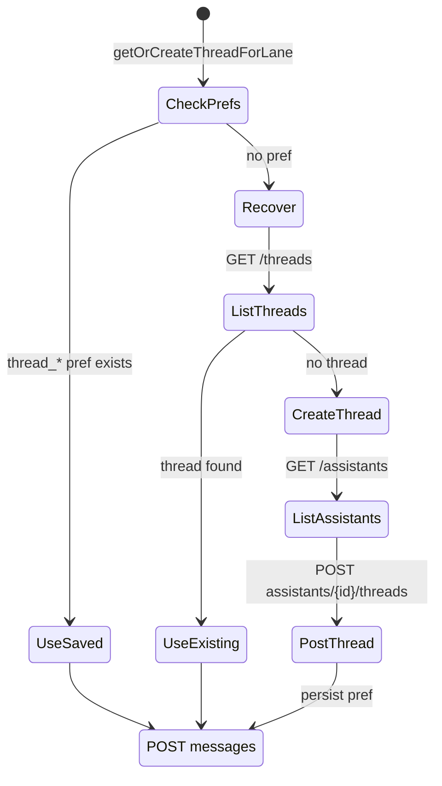

# API integration (Backboard)

AuraFlow communicates with the **Backboard** REST API at:

```
https://app.backboard.io/api/
```

All requests are authenticated via OkHttp interceptors in `RetrofitClient.kt` (see [Configuration](CONFIGURATION.md) for key management).

---

## Client setup

| Setting | Value |
|---------|-------|
| Base URL | `https://app.backboard.io/api/` |
| Converter | Gson (`GsonConverterFactory`) |
| Connect timeout | 30 seconds |
| Read / write timeout | 120 seconds |
| Headers | `X-API-Key`, `Authorization: Bearer <key>` |

---

## Endpoints used

Defined in `AuraFlowApiService.kt`:

| Method | Path | Purpose |
|--------|------|---------|
| `GET` | `assistants` | List assistants (thread creation) |
| `GET` | `threads` | List threads (recovery) |
| `GET` | `threads/{thread_id}` | Fetch thread + messages (synthesis context) |
| `POST` | `assistants/{assistant_id}/threads` | Create thread for assistant |
| `POST` | `threads/{thread_id}/messages` | Send user payload; receive LLM completion |
| `POST` | `threads/{thread_id}/runs/{run_id}/submit-tool-outputs` | Complete tool-calling runs |
| `POST` | `threads/{thread_id}/files` | Upload document to thread (multipart) |
| `POST` | `files` | Global file upload (multipart) |

---

## Primary chat request

### `POST threads/{thread_id}/messages`

**Body:** `BackboardRequest`

```json
{
  "content": "<assembled prompt string>",
  "role": "user",
  "send_to_llm": true,
  "memory_pro": "Auto",
  "llm_provider": "google",
  "model_name": "gemini-3.1-flash",
  "web_search": "Auto",
  "thinking": { "effort": "high" }
}
```

Fields set by the app:

| Field | When set |
|-------|----------|
| `llm_provider` | `"google"` from ViewModel |
| `model_name` | User selection: `gemini-3.1-flash` or `gemini-3.1-pro-preview` |
| `web_search` | `"Auto"` if enabled, else `"off"` |
| `thinking` | `{ "effort": "high" }` if Deep Think enabled, else omitted |

The `content` field is a single string built in `LlmRepository.sendMessage` containing:

- System prompt (persona, rules, output format)
- Lane name
- Fatigue score and level
- Recent lane and global memories
- Cross-thread context (SYNTHESIS only)
- Raw user input

### Response: `BackboardResponse`

| Field | Type | Meaning |
|-------|------|---------|
| `id` | string? | Message id |
| `content` | JsonElement? | Assistant text (nested shapes supported) |
| `status` | string? | e.g. `REQUIRES_ACTION` for tools |
| `run_id` | string? | Run id for tool submission |
| `tool_calls` | list? | Pending function calls |
| `reasoning` | string? | Shown in UI as “REASONING >>” |

---

## Content extraction

`LlmRepository.extractAssistantText` handles:

- JSON primitive string
- Object with `value` or nested `text.value`
- Array of content parts (first non-blank wins)

This accommodates varying Backboard response shapes without a rigid DTO.

---

## Tool-calling loop

When `status == "REQUIRES_ACTION"` and `tool_calls` is non-empty:

1. For each call, `dispatchMockTool(name, arguments)` returns a JSON string
2. Build `ToolOutputRequest` with `tool_call_id` + `output`
3. `POST .../submit-tool-outputs`
4. Repeat until status is no longer `REQUIRES_ACTION`

### Mock tools implemented

| Function name | Mock output |
|---------------|-------------|
| `log_fitness_record` | Success JSON for logged workout |
| `check_weather` | Clear skies, 24°C |
| *(other)* | Generic executed status |

Replace these with real integrations when Backboard assistants define production tools.

---

## Thread lifecycle



**SharedPreferences file:** `auraflow_threads`

| Key | Lane |
|-----|------|
| `thread_iron` | IRON |
| `thread_ink` | INK |
| `thread_synthesis` | SYNTHESIS |

On HTTP **404** for a message post, the repository attempts `recoverThreadIdFromAccount`, updates prefs, and retries once.

---

## Model fallback

If the initial request fails (HTTP 4xx+) or returns soft-fail content (`LLM Error:` + “supported models”), a second request is sent with:

- `llmProvider = null`
- `modelName = null`
- `thinking = null`
- `webSearch = null`

Backboard then selects a default compatible model for the account.

---

## Document upload

### Multipart endpoints

- `POST files` — `MultipartBody.Part` field name from caller
- `POST threads/{thread_id}/files` — same, scoped to thread

**Response:** `DocumentResponse` with `document_id`, `status`

### Fallback

If uploads fail, file body may be read from the multipart part (up to 10k chars) and sent as a normal `BackboardRequest` message with `[DOCUMENT CONTENT]` prefix.

### UI-driven analysis

`processDocumentAsMessage` sends:

```
[DOCUMENT: {fileName}]
Please analyze and summarize...
{content}
```

No separate upload endpoint required when this path succeeds.

---

## Error surface to users

| Condition | User-visible pattern |
|-----------|----------------------|
| HttpException | `COM_LINK_ERROR: HTTP {code} - {body}` |
| Other exceptions | `COM_LINK_ERROR: {message}` |
| Upload 400–413 | Specific upload failed messages |
| Empty assistant content | `Error: Empty response string from Backboard.` |

Log full bodies in Logcat during development; avoid showing raw API errors to end users in production builds.

---

## System prompt summary

The embedded system prompt defines Aura-Flow Shadow as:

- Tactical assistant bridging Iron (physical) and Ink (cognitive)
- Target context: Data Science specialization, exams May 2026
- Markdown output, ≤160 words unless deep detail requested
- Structured blocks for performance queries only

Customize this string in `LlmRepository` for different personas or languages.

---

## Related code

| File | Responsibility |
|------|----------------|
| `AuraFlowApiService.kt` | Retrofit interface |
| `LlmModels.kt` | Request/response types |
| `LlmRepository.kt` | Business logic, prompts, recovery |
| `RetrofitClient.kt` | HTTP client factory |

See also [Architecture](ARCHITECTURE.md) for how the ViewModel invokes the repository.
