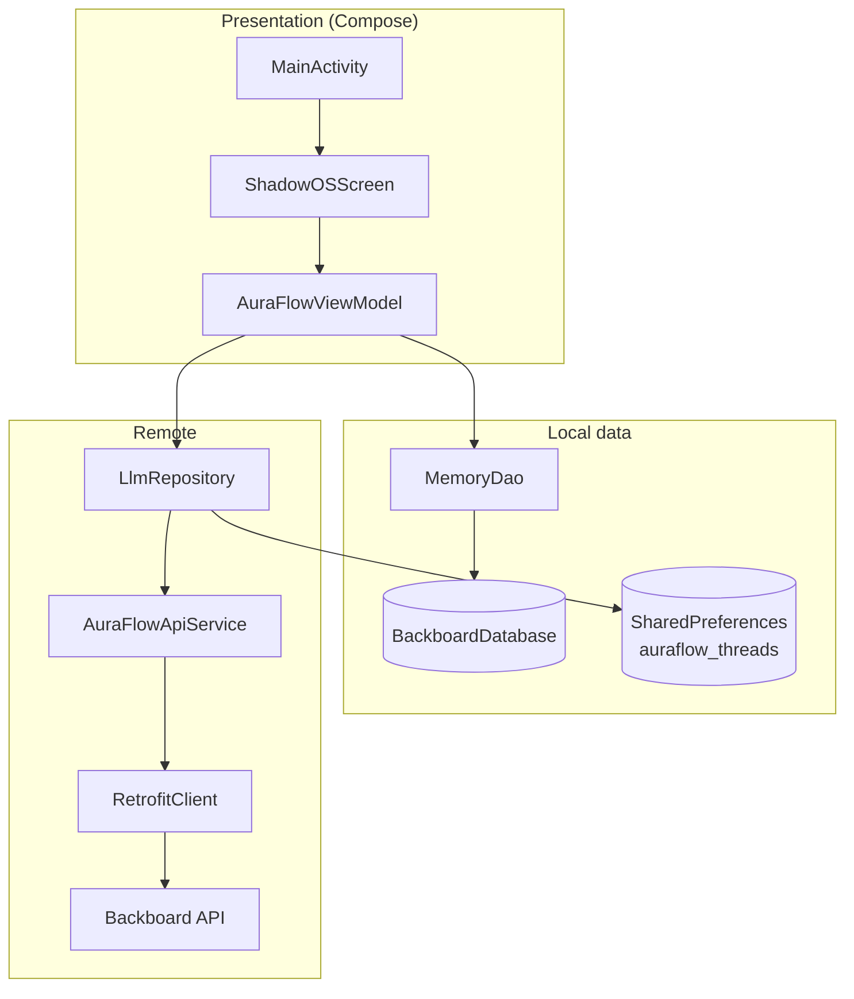
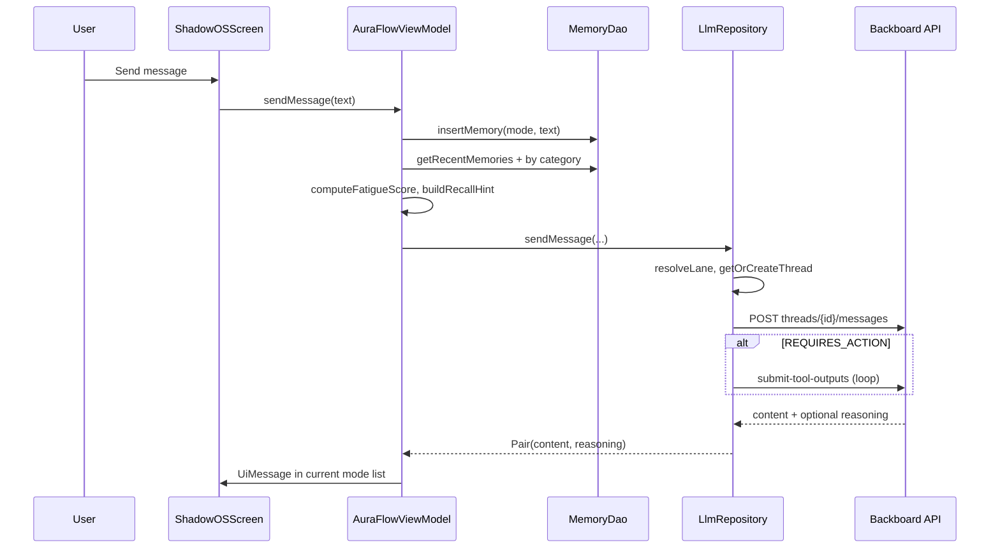

# Architecture

AuraFlow follows a classic Android **single-activity, MVVM** layout: UI in Jetpack Compose, state in `AuraFlowViewModel`, persistence in Room, and remote AI in `LlmRepository` via Retrofit.

---

## High-level diagram



---

## Layers

### 1. Presentation (`ui/`)

| Component | Role |
|-----------|------|
| `MainActivity` | Hosts Compose content, applies `AuraFlowTheme`, edge-to-edge window |
| `ShadowOSScreen` | Main shell: tabs, chat, focus meter, memory view, settings |
| `AuraFlowViewModel` | Chat state, mode switching, aura/fatigue, orchestrates DAO + repository |
| `ui/theme/` | Dark Material3 scheme, accent colors (cyan, purple, mint) |

The UI is organized into four bottom tabs:

1. **Command** — Chat, document attach, send
2. **Focus** — Aura fluid bar, rank, fatigue, mode label
3. **Memory** — Recall anchor from local DB
4. **System** — Web Search, Deep Think, model toggle

Mode pills (`IRON`, `INK`, `IRONK`) sit below the top bar and switch independent conversation histories per mode.

### 2. Domain / application logic (`AuraFlowViewModel`)

Responsibilities:

- Maintain **per-mode** message lists, loading flags, and aura scores
- On `sendMessage`: persist user text → load memories → compute fatigue → call `LlmRepository`
- Score messages to adjust **Aura** (gamification heuristic, not ML-based)
- Expose toggles for web search, deep think, and selected Gemini model id

### 3. Data (`data/`)

| Piece | Purpose |
|-------|---------|
| `MemoryState` | Room entity: category (mode), content, timestamp |
| `MemoryDao` | Insert + query recent global / per-category memories |
| `BackboardDatabase` | Singleton Room DB file `backboard_database` |

Thread IDs for Backboard lanes are **not** in Room; they live in `SharedPreferences` (`auraflow_threads`), managed inside `LlmRepository`.

### 4. Network (`network/`)

| Piece | Purpose |
|-------|---------|
| `RetrofitClient` | OkHttp client, auth headers, 30s connect / 120s read-write timeouts |
| `AuraFlowApiService` | Retrofit interface for Backboard REST |
| `LlmModels.kt` | Gson DTOs for requests/responses |
| `LlmRepository` | System prompt assembly, lane resolution, API calls, fallbacks, tool loop |

---

## Message flow (chat)



---

## Mode vs lane mapping

The UI exposes three **modes**. The repository maps them to Backboard **lanes** (conversation threads):

| UI mode | Typical use | Resolved lane | Thread prefs key |
|---------|-------------|---------------|------------------|
| `IRON` | Workouts, lifting, recovery | `IRON` | `thread_iron` |
| `INK` | Study, exams, focus work | `INK` | `thread_ink` |
| `IRONK` | Combined physical + cognitive planning | `SYNTHESIS` | `thread_synthesis` |

Additional rules in `LlmRepository.resolveLane`:

- `IRONK` always uses **SYNTHESIS**
- If the user message mentions both fitness and study keywords, lane becomes **SYNTHESIS** even in IRON or INK mode

For **SYNTHESIS**, `buildCrossThreadContext()` pulls the latest messages from IRON and INK threads (if thread IDs exist) and injects them into the prompt.

---

## Structured assistant output

The system prompt in `LlmRepository` instructs the model to:

- Reply in **plain Markdown** for casual chat
- Use **structured sections** for performance/focus queries:

```
## Status
## Focus Now
## Next Block (30-90m)
## Risk Check
```

`IntelligentMessageRenderer` in `ShadowOSScreen.kt` parses `##` blocks and renders custom cards (status chips, focus card, task list, risk warning). Other sections use lightweight `**bold**` parsing.

---

## Document processing flow

Two paths exist:

1. **UI path (primary)** — `GetContent` picker → read bytes on IO dispatcher → PDF via iText7 (max 10 pages) or UTF-8 text → `processDocumentContent()` → message to Backboard with analysis prompt
2. **Multipart upload path** — `uploadDocument()` tries `POST /files` and `POST /threads/{id}/files`, then falls back to embedding content in a chat message

The UI enforces a **5 MB** size limit and supports plain text, JSON, XML, HTML, CSV, and PDF.

---

## Error handling strategy

| Layer | Behavior |
|-------|----------|
| HTTP errors | `COM_LINK_ERROR: HTTP {code} - {body}` shown in chat |
| 404 thread | Auto-recover: list threads, or create thread for first assistant |
| Model / feature 400 | Retry with `llmProvider`, `modelName`, `thinking`, `webSearch` nulled |
| Soft LLM failures | Detect `"LLM Error:"` in content and retry with fallback request |
| Upload | User-facing strings; logs under tags `AuraFlow`, `AuraFlowUpload`, `AuraFlowDoc` |

---

## State management conventions

- **ViewModel** exposes `StateFlow` for Compose `collectAsState()`
- **Per-mode maps** (`_messagesByMode`, `_isLoadingByMode`, `_auraByMode`) keep histories isolated when switching pills
- **Room** uses `Flow` queries; ViewModel uses `firstOrNull()` inside coroutines for one-shot reads

---

## Design patterns used

- **Singleton** — `RetrofitClient`, `BackboardDatabase.getDatabase()`
- **Repository** — `LlmRepository` abstracts Backboard complexity from ViewModel
- **DTO mapping** — Gson `SerializedName` for snake_case API fields
- **Defensive fallback chain** — model, thread, and upload recovery without crashing the app

---

## Extension points

Reasonable places to extend without restructuring:

- Replace mock tools in `dispatchMockTool` with real fitness/weather APIs
- Add Room migrations when changing `MemoryState` schema
- Introduce Navigation Compose if adding multiple activities or deep links
- Centralize API key injection via Hilt/Koin and `BuildConfig`
- Persist chat `UiMessage` lists to Room for history across app restarts
