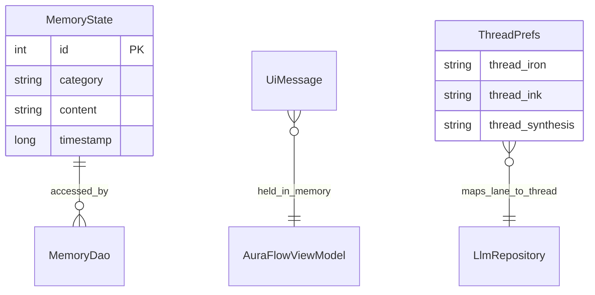

# Data model

Local persistence, in-memory UI state, and scoring formulas used by AuraFlow.

---

## Room: `memory_state`

### Entity: `MemoryState`

| Column | Type | Description |
|--------|------|-------------|
| `id` | INTEGER (PK, auto) | Row id |
| `category` | TEXT | Mode lane: `IRON`, `INK`, or mode string at insert time |
| `content` | TEXT | User message text |
| `timestamp` | INTEGER | `System.currentTimeMillis()` at insert |

Table name: `memory_state`  
Database: `backboard_database` (version **1**)

### DAO operations

| Method | SQL / behavior |
|--------|----------------|
| `insertMemory` | INSERT one row |
| `getRecentMemories` | Last **20** rows, all categories, `timestamp DESC` |
| `getRecentMemoriesByCategory` | Last **10** rows for `:category` |
| `clearAllMemories` | DELETE all (not wired to UI) |

### When rows are written

On every `sendMessage` in `AuraFlowViewModel`, before the API call:

```kotlin
memoryDao.insertMemory(MemoryState(category = mode, content = text))
```

Document analysis and upload status messages are **not** persisted to Room unless sent through `sendMessage`.

---

## SharedPreferences: thread mapping

Not part of Room; stored by `LlmRepository`.

| Key | Lane constant |
|-----|---------------|
| `thread_iron` | `IRON` |
| `thread_ink` | `INK` |
| `thread_synthesis` | `SYNTHESIS` |

Values are Backboard `thread_id` strings.

---

## UI state: `UiMessage`

Ephemeral (in-memory only, lost on process death):

| Field | Type | Description |
|-------|------|-------------|
| `content` | String | Message body |
| `isUser` | Boolean | User vs assistant |
| `reasoning` | String? | Optional chain-of-thought from API |

### Per-mode maps in ViewModel

| StateFlow backing map | Keys | Value |
|-----------------------|------|-------|
| `_messagesByMode` | `IRON`, `INK`, `IRONK` | `List<UiMessage>` |
| `_isLoadingByMode` | same | `Boolean` |
| `_auraByMode` | same | `Int` (0–100) |

`setMode` syncs `_messages`, `_isLoading`, and `_auraCounter` from the active mode’s map.

---

## Fatigue score

Computed in `computeFatigueScore(memories)`:

```
last48h = memories where (now - timestamp) <= 48 hours
ironLoad = count(category == "IRON" in last48h) * 12
inkLoad  = count(category == "INK" in last48h) * 7
streakBoost = 20 if last48h.size >= 8 else 0
fatigue = clamp(ironLoad + inkLoad + streakBoost, 0, 100)
```

Exposed as `fatigueScore` StateFlow and shown on Focus tab. Sent to LLM as:

```
fatigue_score=<int>
fatigue_level=low|med|high   // >=75 high, >=45 med, else low
```

High fatigue triggers system-prompt rule: propose lower-load plans.

---

## Memory recall hint

`buildRecallHint(memories)`:

- Empty list → `"No indexed recall yet."`
- Else find first memory where age ≥ **3 days**; if none, use **last** memory in list
- Format: `Recall anchor: {category} -> {content take 90 chars}`

Displayed on Memory tab only (informational).

---

## Aura scoring

Separate per mode; clamped **0–100**.

### User message (`scoreUserMessage`)

Base keyword adjustments:

| Condition | Delta |
|-----------|-------|
| contains can't / cannot / skip | -2 |
| tired / burnout / overwhelmed | -3 |
| done / completed / finished | +4 |
| pr / personal record / improved | +5 |

Mode-specific:

**IRON** — +2 if workout terms (deadlift, squat, bench, workout, reps, sets); else +1  

**INK / other** — +2 if study terms (study, mock, reasoning, math, etc.); else +1  

Result clamped to **[-8, 10]** per message.

### Assistant message (`scoreAssistantMessage`)

| Condition | Delta |
|-----------|-------|
| (default) | +1 |
| contains "next block" | +2 |
| contains "risk check" | +1 |
| contains "error" or "com_link_error" | -4 |

Clamped to **[-6, 6]**.

### Rank tiers (Focus UI)

| Aura | Rank |
|------|------|
| ≥ 50 | Apex |
| ≥ 25 | Mastery |
| ≥ 10 | Adept |
| < 10 | Initiate |

---

## Context sent to Backboard

On each message, repository receives:

| Source | Limit | Format |
|--------|-------|--------|
| `laneMemories` | 5 | `- {content}` |
| `memoryContext` | 6 | `- [{category}] {content}` |
| Cross-thread (SYNTHESIS) | latest from IRON + INK threads | prose summaries |

Room provides the first two; Backboard thread API provides cross-thread history for synthesis.

---

## JSON API models (network)

Key types in `LlmModels.kt`:

- `BackboardRequest` — outbound message
- `BackboardResponse` — completion + tools + reasoning
- `ToolCall`, `ToolOutput`, `ToolOutputRequest` — tool loop
- `BackboardThread`, `BackboardAssistant`, `BackboardThreadDetails` — thread management
- `DocumentResponse` — upload result

`content` fields often use `JsonElement` for flexible parsing.

---

## Entity relationship (conceptual)



---

## Future schema ideas

If you extend persistence:

- `ChatMessage` entity for full thread history and export
- `AuraSnapshot` for daily aggregates
- `DocumentMeta` for uploaded file names and ids
- Foreign keys from messages to mode enum table

Bump `BackboardDatabase` version and add migrations for any production release.

---

## Related docs

- [Architecture](ARCHITECTURE.md)
- [User guide](USER_GUIDE.md) — what users see for Aura and fatigue
